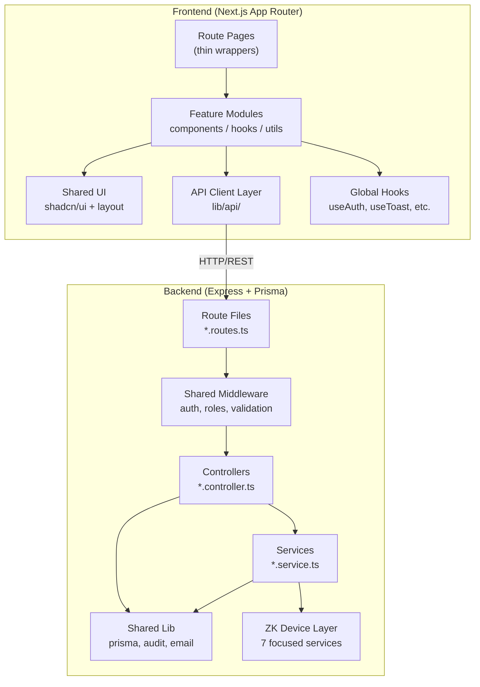

# Codebase Refactoring Evaluation

## Executive Summary

**Overall Verdict: The refactor is a significant net positive — ~70% well-executed, ~30% incomplete.**

The backend modularization is **strong**. The `modules/` architecture with domain-specific folders, barrel exports, and clear route→controller→service separation is well-designed and scalable. The ZK device layer split into 7 focused service files is particularly well done.

The frontend refactor is **mixed**. Some features (employees, attendance, reports) successfully adopted the `features/` pattern with hook/component/util separation. However, **many pages were never migrated** and remain as monolithic 400–800 line `page.tsx` files — the very problem the refactor was meant to solve.

---

## 1. Code Structure Evaluation

### Backend Structure — ✅ Well Organized

```
backend/src/
├── app.ts                    # Express app setup, route mounting
├── index.ts                  # Server bootstrap
├── modules/                  # Domain-driven modules ✅
│   ├── attendance/           # controller, service, routes, types, index
│   ├── auth/                 # controller, routes, validator, index
│   ├── devices/              # controller, services, routes, types
│   │   └── zk/               # 7 focused ZK hardware services ✅✅
│   ├── employees/            # Split into crud/biometric/export/sync ✅
│   ├── logs/                 # controller, routes, types, index
│   ├── me/                   # Self-service endpoints
│   ├── organization/         # branch + department controllers
│   ├── reports/              # controller, service, routes, types
│   ├── shifts/               # controller, routes, types, utils
│   ├── system/               # schedulers, controllers, routes
│   └── users/                # controller, routes, types, validator
├── shared/                   # Cross-cutting concerns ✅
│   ├── config/               # Swagger config
│   ├── events/               # EventEmitters (attendance, device)
│   ├── lib/                  # Prisma, audit logger, cron, email, zk-driver
│   ├── middleware/            # auth, CORS, validation, roles, correlation
│   ├── types/                # Shared type definitions
│   └── utils/                # Password, Prisma errors, response, token
├── constants/                # (Empty — unused)
└── scripts/                  # Utility scripts
```

**Strengths:**
- Each module has a consistent internal structure: `*.controller.ts`, `*.routes.ts`, `*.types.ts`, `index.ts`
- Barrel `index.ts` files enable clean imports: `from './modules/employees'`
- `shared/` properly separates cross-cutting concerns from domain logic
- The ZK device layer split (`zk-connection`, `zk-lock`, `zk-user`, `zk-fingerprint`, `zk-card`, `zk-reconcile`, `zk-sync`) is excellent modular design

### Frontend Structure — ⚠️ Partially Refactored

```
frontend/src/
├── app/                      # Next.js App Router pages
│   ├── (admin)/              # Admin route group
│   ├── (hr)/                 # HR route group
│   ├── (employee)/           # Employee self-service
│   └── (auth)/               # Login
├── features/                 # Feature-based modules ✅ (partial)
│   ├── attendance/           # components, hooks, utils, types
│   ├── employees/            # components, hooks, utils ✅ Best example
│   ├── biometrics/           # components only
│   ├── dashboard/            # components only (1 giant file ⚠️)
│   ├── devices/              # components, hooks
│   ├── reports/              # components, hooks, lib
│   └── adjustments/          # components, types
├── components/               # Shared UI components
│   ├── layout/               # Sidebar, topbar, layout per role
│   └── ui/                   # shadcn/ui components
├── hooks/                    # Global hooks (useAuth, useToast, etc.)
├── lib/                      # API client, validation, utilities
│   └── api/                  # Centralized API layer ✅
└── types/                    # Shared type definitions
```

**Strengths:**
- `features/employees/` is the gold-standard pattern in this codebase — hooks, components, and utils cleanly separated
- Thin page files (`page.tsx` at 5–11 lines) delegating to feature components is ideal
- Global shared hooks (`useAuth`, `useToast`, `useTableSort`) properly extracted
- Centralized API client with typed `apiFetch` helper

---

## 2. Maintainability & Readability

### Backend — ✅ Good

| Aspect | Rating | Notes |
|--------|--------|-------|
| File sizes | ⚠️ Acceptable | Largest files: `attendance.service.ts` (908 lines), `employee-crud.controller.ts` (863 lines) — approaching the upper limit |
| Code comments | ✅ Excellent | Rich JSDoc, inline explanations for business logic (e.g., PHT timezone handling, ZK device quirks) |
| Error handling | ✅ Consistent | Try/catch in every handler with structured JSON error responses |
| Separation of concerns | ✅ Good | Controllers handle HTTP; services handle business logic |
| Naming | ✅ Clear | `employee-crud.controller.ts`, `zk-fingerprint.service.ts` — self-documenting |

> [!TIP]
> The `attendance.service.ts` at 908 lines is the biggest file in the backend. The `calculateAttendanceMetrics()` function alone is ~200 lines — this could be extracted to its own `attendance-metrics.utils.ts`.

### Frontend — ⚠️ Inconsistent

| Aspect | Rating | Notes |
|--------|--------|-------|
| Refactored features | ✅ Good | `employees/`, `attendance/`, `reports/` are well-structured |
| Unrefactored pages | ❌ Poor | 8+ pages are still 400–800 line monoliths |
| Code duplication | ⚠️ Notable | Admin/HR sidebars, device panels in DashboardPage share duplicated JSX |
| Component reuse | ⚠️ Mixed | Some features reuse components (`EmployeeListPage` used by both admin & HR), but many don't |

### Monolithic Pages Still Remaining

These `page.tsx` files were **not refactored** and remain as large monolithic files:

| File | Lines | Status |
|------|-------|--------|
| `(hr)/hr/organization/page.tsx` | **823** | ❌ Not refactored |
| `(admin)/organization/page.tsx` | **822** | ❌ Not refactored |
| `(admin)/shifts/page.tsx` | **756** | ❌ Not refactored |
| `(hr)/hr/branches/page.tsx` | **626** | ❌ Not refactored |
| `(admin)/admin/user-accounts/page.tsx` | **609** | ❌ Not refactored |
| `(admin)/admin/logs/page.tsx` | **573** | ❌ Not refactored |
| `(hr)/hr/shifts/page.tsx` | **460** | ❌ Not refactored |
| `(hr)/hr/settings/page.tsx` | **412** | ❌ Not refactored |
| `(admin)/admin/adjust/page.tsx` | **399** | ❌ Not refactored |
| `(admin)/settings/page.tsx` | **350** | ❌ Not refactored |
| `(admin)/devices/page.tsx` | **349** | ❌ Not refactored |

> [!WARNING]
> These 11 monolithic pages total **~6,200 lines** of unrefactored code. The pattern that was applied to `employees/` and `attendance/` needs to be extended to these pages to complete the refactor.

---

## 3. Best Practices Alignment

### Backend ✅

| Practice | Status | Details |
|----------|--------|---------|
| Layered architecture | ✅ | Routes → Controllers → Services → Prisma |
| Input validation | ✅ | Zod validators + express-validator middleware |
| Auth middleware | ✅ | JWT cookie-based, role middleware, fresh DB check |
| Audit logging | ✅ | Centralized `audit()` utility used consistently |
| Error responses | ✅ | Structured `{ success, message, error }` format |
| Environment handling | ✅ | dotenv, dev vs production error detail toggle |
| API documentation | ✅ | Swagger/OpenAPI annotations on every route |
| Correlation IDs | ✅ | Request tracing via `correlationId` middleware |
| Fire-and-forget patterns | ✅ | Device sync uses `setImmediate()` to avoid blocking HTTP responses |

### Frontend ✅ (where refactored)

| Practice | Status | Details |
|----------|--------|---------|
| Feature-based architecture | ⚠️ Partial | Applied to 7/18+ page domains |
| Hook extraction | ✅ | `useEmployees`, `useAttendanceStream`, `useReportData` |
| Thin page components | ✅ | Refactored pages are 5–11 lines delegating to features |
| Shared UI library | ✅ | shadcn/ui components with consistent styling |
| Toast notifications | ✅ | Unified `useToast` hook replacing native alerts |
| Type safety | ⚠️ Mixed | Good types in `features/employees/utils/employee-types.ts`, but `any` used in DashboardPage |
| API layer | ✅ | Centralized `lib/api/` with typed client |

### Anti-Patterns Detected

> [!CAUTION]
> **1. Missing service layer in backend controllers**
> The `attendance.controller.ts` has direct Prisma queries for audit logs (lines 338–478) and adjustments (lines 484–680) — ~340 lines of business logic sitting in the controller. This should be in `attendance.service.ts`.

> [!WARNING]
> **2. `DashboardPage.tsx` at 627 lines with `any` types**
> This single component handles data fetching, SSE streams, chart rendering, device status, and activity feeds. It uses `any` for API response typing (lines 76, 81, 136–145). This defeats TypeScript's value.

> [!WARNING]
> **3. Inline `fetch()` calls in `useEmployees` hook and `EmployeeListPage`**
> The `useEmployees` hook makes raw `fetch()` calls instead of using the centralized `apiFetch` from `lib/api/client.ts`. The `handleResetPassword` in `EmployeeListPage.tsx` (line 69) also bypasses the API layer.

> [!NOTE]
> **4. Empty `constants/` directory**
> The `backend/src/constants/` directory exists but is empty — should be cleaned up or populated.

---

## 4. Consistency Assessment

### Naming Conventions

| Area | Consistency | Notes |
|------|-------------|-------|
| Backend file names | ✅ Consistent | `module.type.ts` pattern (e.g., `attendance.controller.ts`) |
| Backend function names | ✅ Consistent | camelCase, verb-first (e.g., `getAttendanceRecords`, `syncZkData`) |
| Frontend feature dirs | ✅ Consistent | lowercase plural nouns (`employees/`, `attendance/`, `devices/`) |
| Frontend components | ⚠️ Mixed | PascalCase files in `features/` but `admin-sidebar.tsx` in `layout/` |
| API responses | ✅ Consistent | All use `{ success: boolean, data/message, meta? }` structure |
| Route prefixes | ✅ Consistent | All under `/api/` with RESTful patterns |

### Module Structure Consistency

| Module | Routes | Controller | Service | Types | Validator | Index |
|--------|--------|------------|---------|-------|-----------|-------|
| attendance | ✅ | ✅ | ✅ | ✅ | ❌ | ✅ |
| auth | ✅ | ✅ | ❌ | ❌ | ✅ | ✅ |
| devices | ✅ | ✅ | ✅✅ | ✅ | ❌ | ✅ |
| employees | ✅ | ✅✅✅ | ❌ | ✅ | ✅ | ✅ |
| logs | ✅ | ✅ | ❌ | ✅ | ❌ | ✅ |
| me | ✅ | ✅ | ❌ | ✅ | ❌ | ✅ |
| organization | ✅✅ | ✅✅ | ❌ | ✅ | ❌ | ✅ |
| reports | ✅ | ✅ | ✅ | ✅ | ❌ | ✅ |
| shifts | ✅ | ✅ | ❌ | ✅ | ❌ | ✅ |
| system | ✅✅ | ✅✅ | ❌ | ✅ | ❌ | ✅ |
| users | ✅ | ✅ | ❌ | ✅ | ✅ | ✅ |

> [!NOTE]
> Several modules (`auth`, `shifts`, `users`, `logs`) have business logic directly in controllers without a separate service layer. This is acceptable for simple CRUD but becomes problematic as complexity grows.

---

## 5. Improvement Recommendations

### 🔴 High Priority — Complete the Frontend Refactor

The most impactful improvement is finishing what was started. Apply the `features/employees/` pattern to the remaining monolithic pages:

| Page to Refactor | Lines | Recommended Feature Module |
|-------------------|-------|---------------------------|
| `organization/page.tsx` (×2) | 822–823 | `features/organization/` |
| `shifts/page.tsx` (×2) | 460–756 | `features/shifts/` |
| `user-accounts/page.tsx` | 609 | `features/user-accounts/` |
| `logs/page.tsx` | 573 | `features/logs/` |
| `branches/page.tsx` | 626 | Merge into `features/organization/` |
| `settings/page.tsx` (×2) | 350–412 | `features/settings/` |
| `DashboardPage.tsx` | 627 | Split into sub-components |

Each should follow the pattern:
```
features/<name>/
├── components/     # UI components
├── hooks/          # Data fetching + state management
├── utils/          # Helpers, formatters
└── types.ts        # Type definitions
```

### 🟡 Medium Priority — Backend Service Layer Gaps

**Move business logic out of controllers into services:**

1. **`attendance.controller.ts`** — Extract `getAttendanceAuditLogs`, `getAdjustments`, `reviewAdjustment` business logic into `attendance.service.ts`
2. **`employee-crud.controller.ts`** — Extract the create/update validation and device sync orchestration into an `employee.service.ts`
3. **`auth.controller.ts`** (380 lines) — Extract JWT token operations and login logic into `auth.service.ts`

### 🟡 Medium Priority — Use the Centralized API Client Everywhere

The `useEmployees` hook and several components make raw `fetch()` calls instead of using the centralized `apiFetch` from `lib/api/client.ts`. This causes:
- Inconsistent auth handling (some use `credentials: 'include'`, some don't)
- Duplicated error handling
- No centralized request interceptors

### 🟢 Low Priority — Cleanup & Polish

| Item | Details |
|------|---------|
| Remove empty `constants/` | Backend `src/constants/` is empty |
| Reduce `any` usage | `DashboardPage.tsx` uses `any` extensively — add proper interfaces |
| Deduplicate sidebar components | `admin-sidebar.tsx` (371 lines) and `hr-sidebar.tsx` (280 lines) share significant code — extract a shared `Sidebar` component |
| Deduplicate device panels | Dashboard renders device cards twice (admin section + HR section) — extract a `DeviceStatusGrid` component |
| Add `types.ts` to features missing them | `biometrics/`, `devices/`, `dashboard/` features lack dedicated type files |
| Standardize component file naming | Layout uses `kebab-case.tsx`, features use `PascalCase.tsx` — pick one |

---

## Architecture Diagram



---

## Final Scorecard

| Category | Score | Notes |
|----------|-------|-------|
| **Backend Structure** | **9/10** | Excellent modular design, only missing some service layers |
| **Frontend Structure** | **6/10** | Good pattern established but only ~40% of pages refactored |
| **Maintainability** | **7/10** | Well-commented, good error handling; some files still too large |
| **Best Practices** | **8/10** | Strong auth, audit logging, API docs; some `any` types and raw `fetch()` |
| **Consistency** | **7/10** | Good internal conventions; inconsistent application across all pages |
| **Overall** | **7.5/10** | Solid foundation — completing the frontend migration is the #1 priority |

> [!IMPORTANT]
> **The refactor direction is correct.** The `features/employees/` pattern with `useEmployees` hook + thin route pages is exactly the right architecture. The main gap is that this pattern hasn't been applied everywhere yet. Finishing the migration of the 11 remaining monolithic pages will bring the frontend score from 6/10 to 9/10.
